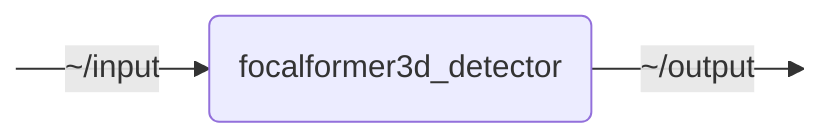

# `focalformer3d_detector`

ROS 2 package integrating the official FocalFormer3D implementation by NVlabs

- [focalformer3d\_detector](#focalformer3d_detector)
  - [Model Dependencies](#model-dependencies)
  - [Model Checkpoint](#model-checkpoint)
  - [`focalformer3d_detector`](#focalformer3d_detector-1)
    - [Subscribed Topics](#subscribed-topics)
    - [Published Topics](#published-topics)
    - [Parameters](#parameters)
    - [Notes](#notes)

## Nodes

### `focalformer3d_detector`

#### Subscribed Topics

| Topic | Type | Description |
| --- | --- | --- |
| `~/input` | `sensor_msgs/msg/PointCloud2` | input point cloud |

#### Published Topics

| Topic | Type | Description |
| --- | --- | --- |
| `~/output` | `perception_msgs/msg/ObjectList` | detected objects |

#### Parameters

| Parameter | Type | Default | Description |
| --- | --- | --- | --- |
| `config_file` | `string` | `/docker-ros/ws/install/focalformer3d_detector/share/focalformer3d_detector/FocalFormer3D/projects/configs/focalformer3d/FocalFormer3D_L.py` | Path to the FocalFormer3D mmdet3d config file |
| `checkpoint_file` | `string` | `/docker-ros/ws/checkpoints/FocalFormer3D_L_ep6_mAP664_NDS709.pth` | Path the FocalFormer3D model checkpoint (.pth) is cached at; it is downloaded from 'checkpoint_url' on first use if not present |
| `checkpoint_url` | `string` | `CHECKPOINT_URL` | URL to download the FocalFormer3D model checkpoint from if it is not cached yet |
| `device` | `string` | `cuda:0` | CUDA device to run inference on |
| `score_threshold` | `float` | `0.1` | Minimum detection confidence for an object to be published |
| `intensity_scale` | `float` | `1.0` | Scale factor applied to the intensity values of the input point cloud; the model was trained on nuScenes intensities in [0, 255] |

## Launch Files

### [`focalformer3d_detector_launch.py`](launch/focalformer3d_detector_launch.py)

| Argument | Default | Description |
| --- | --- | --- |
| `input_topic` | `"~/input"` | input point cloud |
| `output_topic` | `"~/output"` | output object list |
| `name` | `"focalformer3d_detector"` | node name |
| `namespace` | `""` | node namespace |
| `params` | `os.path.join(get_package_share_directory("focalformer3d_detector"), "config", "params.yml")` | path to parameter file |
| `log_level` | `"info"` | ROS logging level (debug, info, warn, error, fatal) |
| `use_sim_time` | `"false"` | use simulation clock |

## Model Checkpoint

The model checkpoint (~189 MiB) is not part of this repository. On the first start, the node downloads it from `checkpoint_url` and caches it at `checkpoint_file`; subsequent starts reuse the cached file. The first start therefore takes noticeably longer and requires internet access.

| Parameter | Default | Description |
| --- | --- | --- |
| `checkpoint_file` | `/docker-ros/ws/checkpoints/FocalFormer3D_L_ep6_mAP664_NDS709.pth` | path the checkpoint is cached at |
| `checkpoint_url` | [Google Drive link](https://drive.google.com/file/d/1OMj00n_pbAotlGi2JyqptYSgpt6mfyu5/view?usp=sharing) published by NVlabs | download source |

The download is verified against a pinned SHA-256 checksum. Since the cache lives inside the container, it is downloaded again after the container is recreated — mount a volume at the parent directory of `checkpoint_file` to persist it across container rebuilds.
